# 🍱 Food App - Chain Restaurant Management System

> A comprehensive order and inventory management system for multi-branch restaurants, featuring OCR integration, real-time communication, and performance reporting.

## 🧰 Technologies Used

- **Backend**: Spring Boot, Spring Data JPA, Spring Security (JWT, OAuth2), Spring WebSocket  
- **Frontend (Mobile)**: Android Java  
- **Databases**: MySQL, MongoDB, Redis  
- **Others**: RESTful API, GitHub Actions (CI/CD), Docker Compose  

## ⚙️ System Architecture

- **JWT + OAuth2**: Secure user authentication and authorization.
- **RESTful API**: Seamless connection between Android app and backend.
- **WebSocket**: Real-time communication between Admin and branches.
- **OCR Engine**: Integrated for automatic order processing from third-party platforms (GrabFood, ShopeeFood).
- **Redis**: Used for caching to enhance performance.
- **Docker Compose**: Simplified deployment with multi-service environment.

## 👥 Core Features

### 👑 Admin (Owner)

- Manage (CRUD) branch accounts.
- Track order history across the entire system.
- OCR integration to auto-import orders from GrabFood and ShopeeFood.
- Detailed reports including:
  - Ingredients usage
  - Inventory status
  - Sales performance by branch
- Real-time communication with all branches via WebSocket.

### 🏪 Branch

- View real-time menu tailored to the specific branch.
- Manage order statuses: Processing / Completed / Cancelled.
- Chat directly with Admin.
- View branch profile and view complete order history.

## 📚 API Documentation

- Swagger UI is available at `/swagger` in development

## 📸 Screenshots

- Home

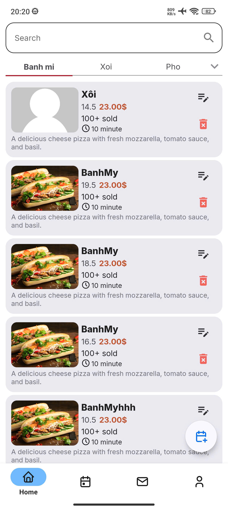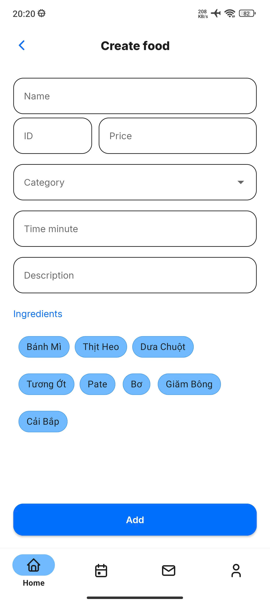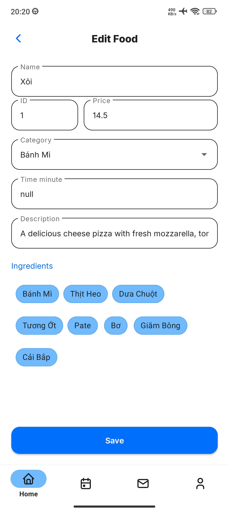

- Order

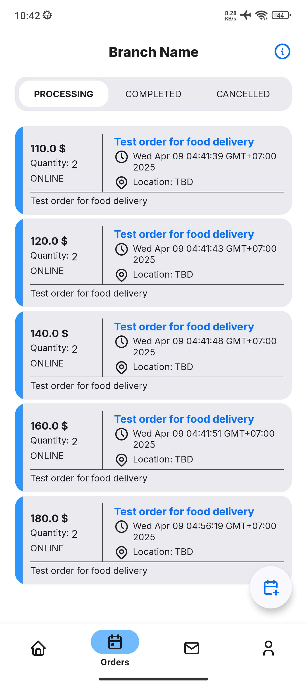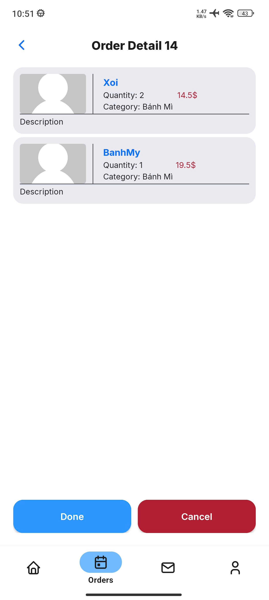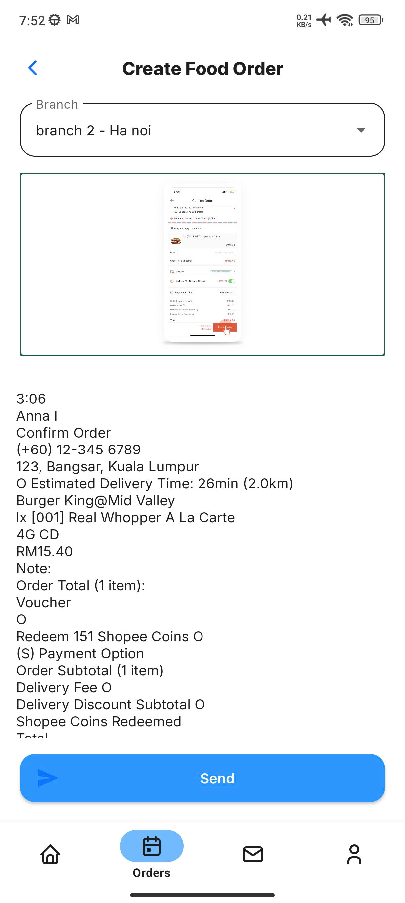

- Message

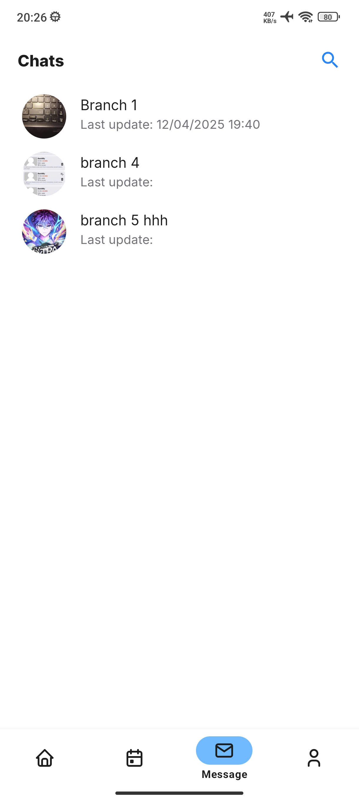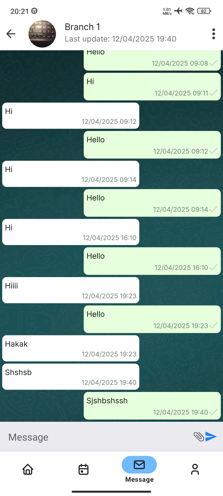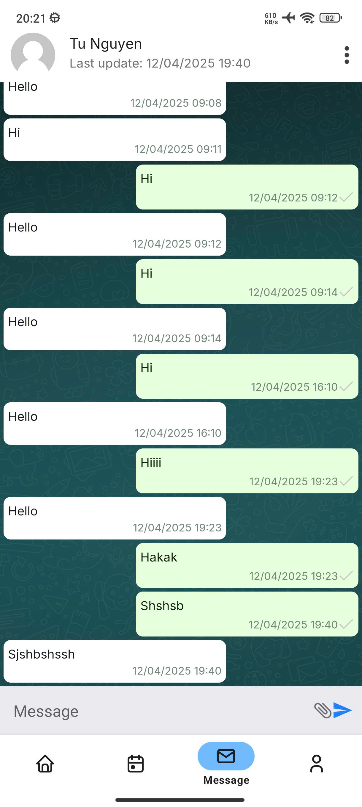

- Account

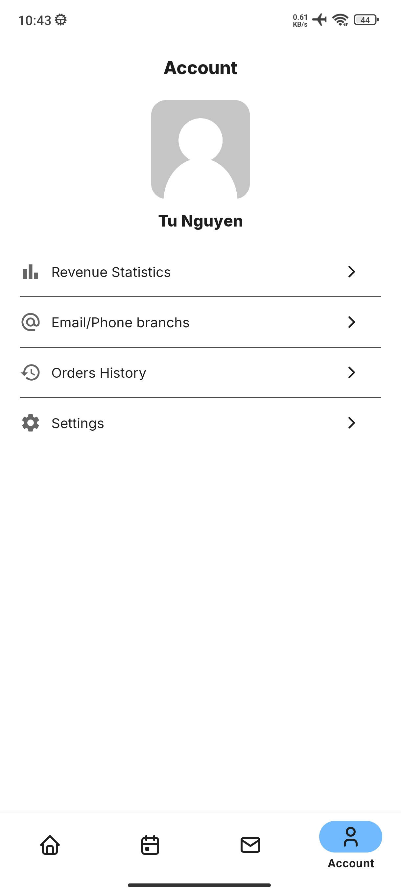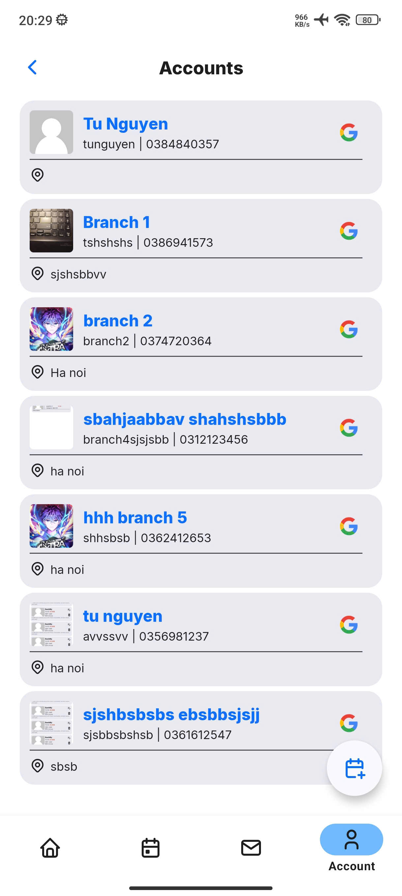

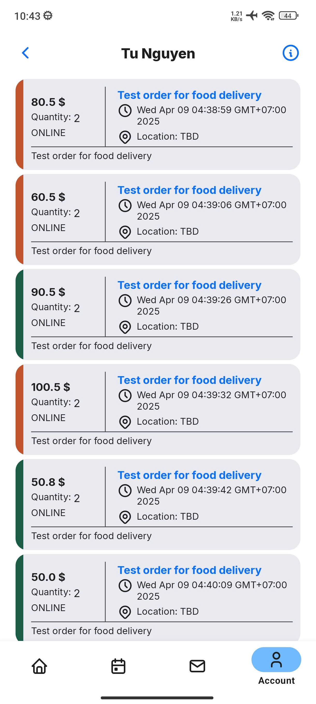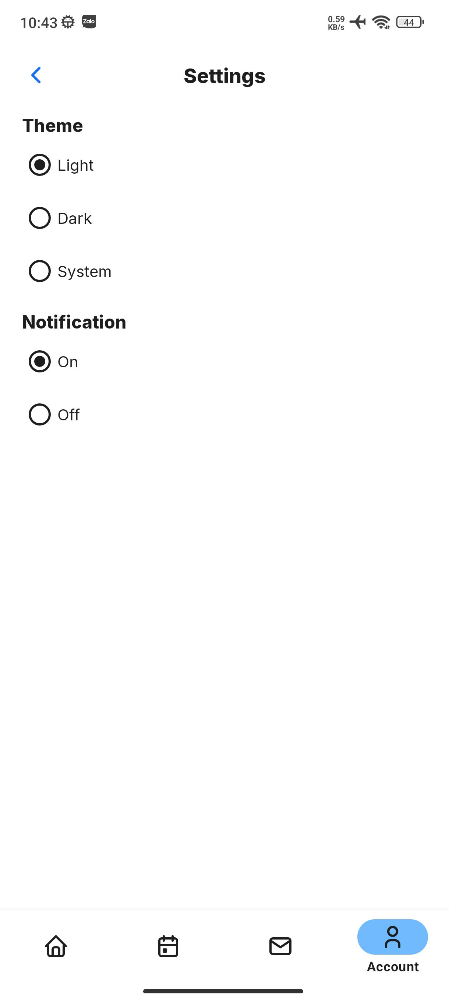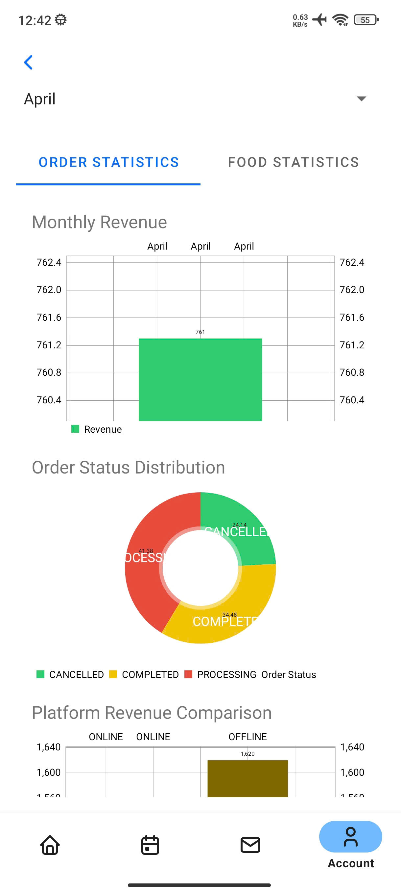

## 🔧 Deployment Guide

- [Backend](./backend/README.md)
- [Frontend](./android/README.md)

## 🧪 Features in Progress

- Real-time inventory sync between Admin and branches.
- OCR support for additional platforms beyond GrabFood and ShopeeFood.
- Realtime analytics dashboard with MongoDB + Redis integration.

## 🧑‍💻 Contributing
Pull requests are welcome! For major changes, please open an issue first to discuss your proposed update.
